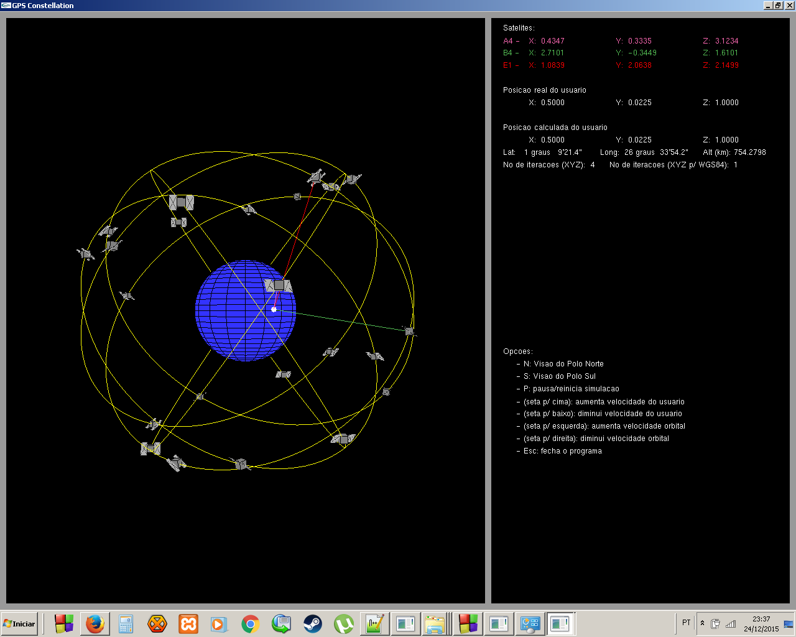

gpsConstellation
================

gpsConstellation is a software written in C and OpenGL to simulate the satellites' orbits of the Global Positioning System.

This software was developed by me in 2011 to the final work for Computer Engineering bachelor at University of Sao Paulo (USP), entitled "Study of the Global Positioning System".

As the paper was originally written and presented in Portuguese-BR, the only existing comments along the code are in this language as well.

Next steps of this project are:

	1. Translate the code comments to English, so it may be used as reference by anyone interested worldwide;

	2. Define a step-by-step to guide its compilation in gcc;

	3. Expand this Readme with:
		3.1 GPS concepts applied in the real world system, 
		Feito --->>> 3.2 Screens of the application (for those who don't want to compile it)
		3.3 Math explanation applied to the real world system and its simplified implementation in this code;
		3.4 More interesting stuff...

Feel free to contact me if you have comment or sugestion..
andrecr12@hotmail.com